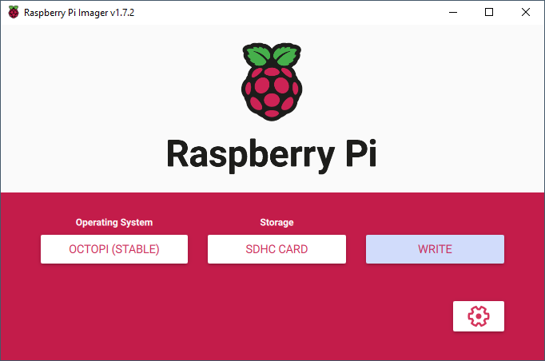

# Instructions
1. [Install Pi imager for windows](https://www.raspberrypi.com/software/)
1. Run the installer.
1. Configure it per the instructions [here](https://octoprint.org/download/).
1. Open advanced options by clicking on the button with the gear, or by using the keyboard shortcut ctrl+shift+x
> Specific settings used are:
> - OS =  "Choose OS" > "Other Specific Purpose OS" > "3D printing" > "OctoPi" > "stable" version.
> - SSID / WiFi stuff
> - Change password only
1. Click save
1. Flash the card.
1. Install the card back into the Raspberry Pi and let it boot up.
1. Verify by going to [router main settings](http://192.168.1.1) that it has connected to the network
1. Install the following 3rd party plugins
> - [ArcWelder](https://plugins.octoprint.org/plugins/arc_welder/)
> - [Automatic Shutdown](https://www.reddit.com/r/octoprint/comments/mm9cbi/automatic_shutdown_after_prints/)
> > Got it working. Installed the plugin shutdown printer https://github.com/devildant/OctoPrint-ShutdownPrinter and set that at 110 degrees and at "Extra command / script" put the line "sudo shutdown -h now". Now the rpi turns off at 110 degrees and turns off the relay connected to the printer.
> - [DisplayLayerProgress](https://all3dp.com/2/must-have-octoprint-plugins/)

OctoPi settings were saved at last install. They can be uploaded from *octoprint-backup-latest.zip*

Once that has completed, set the printer profile settings as follows:
> - **Form factor:** Rectangular
> - **Origin:** Lower Left
> - **Heated Bed:** Yes (checked)
> - **Heated Chamber:** No (unchecked)
> - **Width:** 220mm
> - **Depth:** 220mm
> - **Height:** 250mm
> - **Axes:** Default**
> - **Custom Bounding Box:** No (unchecked)
> - **Nozzle Diameter:** 0.4mm
> - **Number of Extruders:** 1

